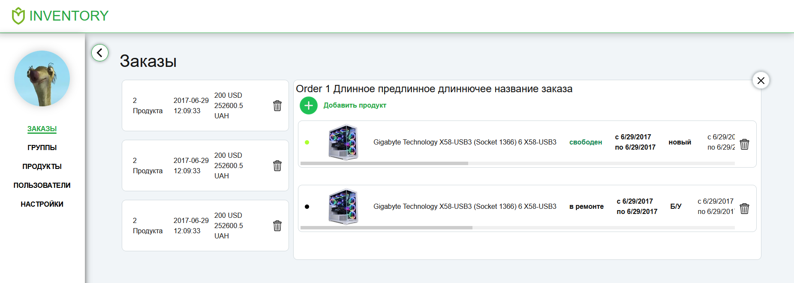

# dzencode-test-tasks

This repository contains a full-stack web application for product and order management.

## Project Structure

- **backend**: Node.js/Express.js server with MySQL database
- **client**: Next.js frontend application with React, Redux, and Bootstrap
- **_info**: Contains sample data and documentation

## Setup Instructions

### Backend Setup

1. Navigate to the backend directory:
   ```bash
   cd backend
   ```

2. Install dependencies:
   ```bash
   npm install
   ```

3. Create a MySQL database named `dzencodedb`

4. Start the backend server:
   ```bash
   npm start
   ```
   The server will run on http://localhost:5000

### Frontend Setup

1. Navigate to the client directory:
   ```bash
   cd client
   ```

2. Install dependencies:
   ```bash
   npm install
   ```

3. Start the development server:
   ```bash
   npm run dev
   ```
   The application will be available at http://localhost:3000

## API Endpoints

- `GET /`: Returns a hello message
- `GET /products`: Returns a list of all products

## Technologies Used

- **Backend**: Node.js, Express.js, MySQL
- **Frontend**: Next.js, React, Redux, Bootstrap, TypeScript
